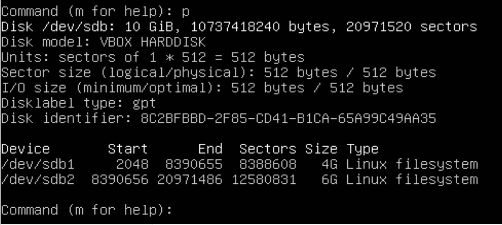
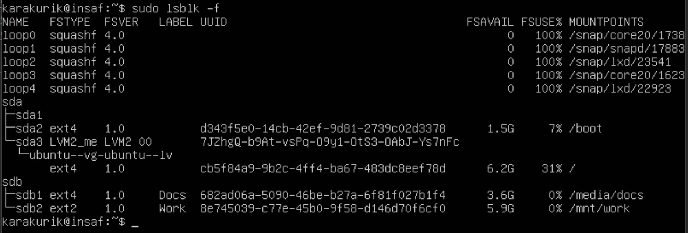
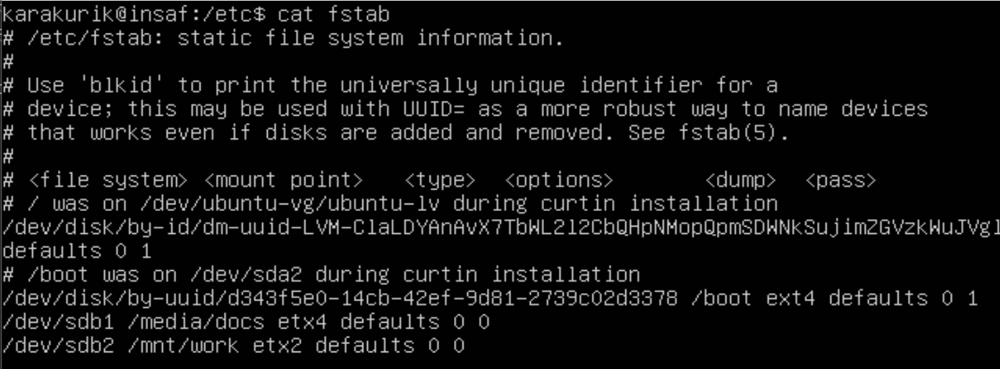
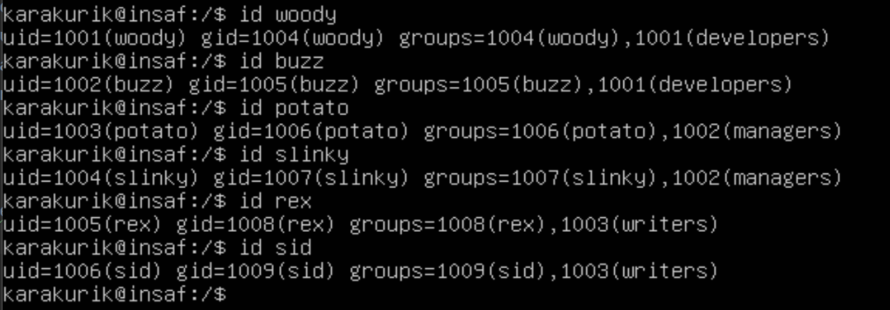
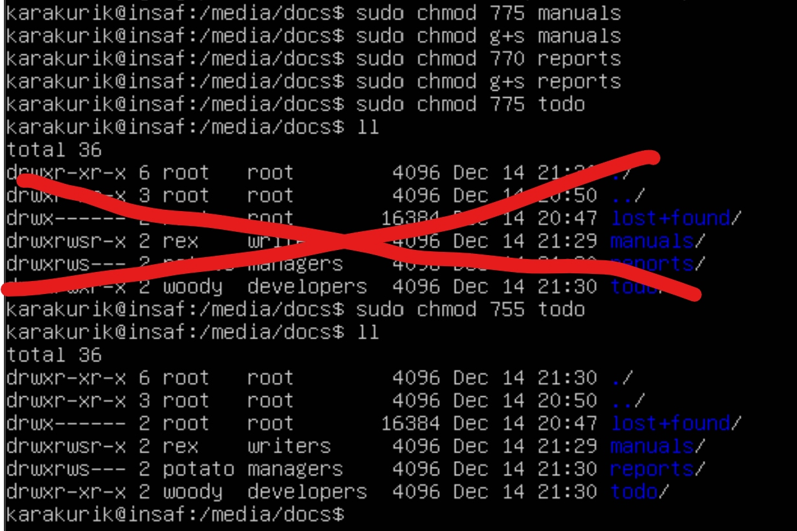
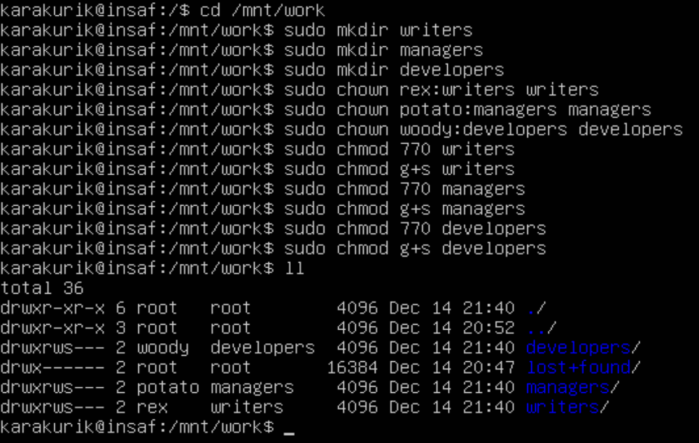
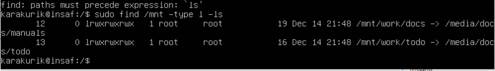

# 3. Файловые системы #
* lsblk -f # определить файл-устройство для диска  
* sudo fdisk /dev/sdb - перейдём для разметки диска от имени администратора  
## Выполняем следующие команды ##
* g - разметка таблицы разделов в формате GPT  
* n - создать раздел  
* 1 - Номер раздела 1  
* Enter - принимаем начальное значение начала раздела
* +4G - установливаем конец раздела через 4Gb, то есть создастся раздел размером 4Gb
* n - создать раздел  
* 2 - номер раздела 2  
* Enter - принимаем начальное значение начала раздела - по умолчанию: конец предыдущего раздела + 1
* +6G - установливаем конец раздела через 6Gb, то есть создастся раздел размером 6Gb

* p - посмотрим, что создалось

* w - выйдем с сохранением

* sudo mkfs.ext4 -L Docs /dev/sdb1 - Отформатируем диск в формате ext4, сразу дадим название Docs с помощью флага -L
* sudo mkfs.ext2 -L Work /dev/sdb2 - Отформатирукм диск в формате ext2, сразу дадим название Work с помощью флага -L
* sudo tune2fs -m 5 /dev/sdb1 - зарезервируем 5% для root пользователя   
* sudo tune2fs -m 0 /dev/sdb2 - зарезервируем 0% для root пользователя  

* sudo mkdir -p /media/docs - создадим поддиректорию /media/docs, параметр -p поможет создать и родительскую директорию /media и поддиректорию docs в ней.
* sudo mount /dev/sdb1 /media/docs - установим монтирование
* sudo mkdir -p /mnt/work - создадим поддиректорию /mnt/work, параметр -p поможет создать и родительскую директорию /mnt и поддиректорию work в ней.
* sudo mount /dev/sdb2 /mnt/work - установим монтирование

* sudo lsblk -f - посмотрим что получилось

Посмотрим, что с монтированием файловой системы:
* cd /etc
* cat fstab 
Чёт записей моих нет
Откроем файл от имени администратора и пропишем монтирование:
* sudo nano fstab - открыть файл от имени администратора
Добавляем в конец строки:
* /dev/sdb1 /media/docs etx4 defaults 0 0
* /dev/sdb2 /mnt/work etx2 defaults 0 0
* ctrl + o - сохранить
* y - подтвердить
* ctrl + x - выйти
Посмотрим, что получилось:

# 4. Пользователи и группы #

## Создание групп:(root права) ##
* sudo addgroup developers  
* sudo addgroup managers  
* sudo addgroup writers  

## Создание пользователей (отключение пороля): ## 
* sudo adduser woody --disabled-password  
* sudo adduser buzz --disabled-password  
* sudo adduser potato --disabled-password  
* sudo adduser slinky --disabled-password  
* sudo adduser rex --disabled-password  
* sudo adduser sid --disabled-password

## Добавление пользователей в группу: ##
Каждый раз будет просить данные, всё оставляем по дефолту, в конце подтверждаем вводом y, что введенные данные верны
* sudo usermod -aG developers woody  
* sudo usermod -aG developers buzz  
* sudo usermod -aG managers potato  
* sudo usermod -aG managers slinky  
* sudo usermod -aG writers rex  
* sudo usermod -aG writers sid

Посмотрим добавленных пользователей:

# 5. Директории и файлы #

## Переход в директорию: ##
* cd /media/docs  
## Создание поддиректорий: ##
* sudo mkdir manuals  
* sudo mkdir reports  
* sudo mkdir todo  
## Смена владельца: ##
* sudo chown rex:writers manuals  
* sudo chown potato:managers reports  
* sudo chown woody:developers todo  
## Установление прав доступа: ##
* sudo chmod 775 manuals
* sudo chmod g+s manuals
* sudo chmod 770 reports
* sudo chmod g+s reports
* sudo chmod 755 todo

Посмотрим, что получилось:
* ll

## Переход в директорию: ##
cd /mnt/work  
## Создание поддиректорий: ##
* sudo mkdir writers  
* sudo mkdir managers  
* sudo mkdir developers  
## Смена владельца: ##
* sudo chown rex:writers writers  
* sudo chown potato:managers managers  
* sudo chown woody:developers developers  
## Установление прав доступа: ##
* sudo chmod 770 writers  
* sudo chmod g+s writers  
* sudo chmod 770 managers  
* sudo chmod g+s managers  
* sudo chmod 770 developers  
* sudo chmod g+s developers

Посмотрим, что получилось:
* ll

## Создадим символьные ссылки(soft links): ##
* sudo cd /mnt/work/developers - перейдём как администратор, ну и создадим ссылки:
* sudo ln -s /media/docs/manuals docs
* sudo ln -s /media/docs/todo todo

